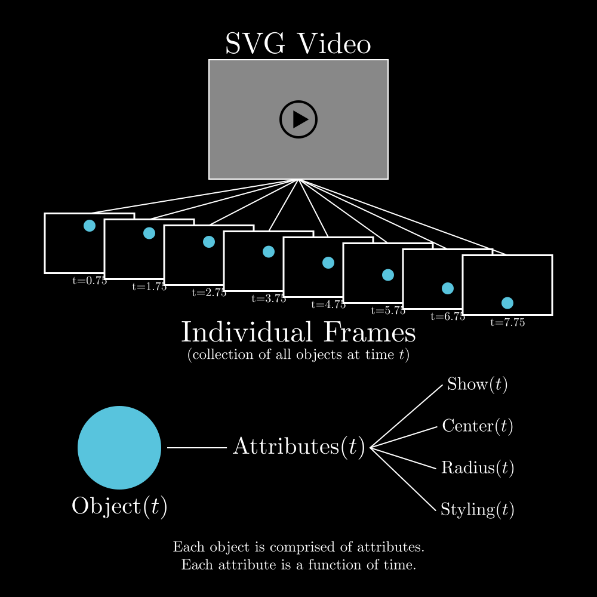

<p align="center">
    
</p>

VectorMation is an entirely vector-based math-oriented animation engine.
It allows for immensely compact representations of animations (using SVGs).

VectorMation also provides an alternative for [manim](https://github.com/3b1b/manim).
The reason I started this project were some pet peeves about manim (like the coordinate system, the timing of animations, the immense amount of functions and not being able to export to SVG).

## Instalation
```{bash}
pip install vectormation
```

## Using VectorMation
After installation, the below python code should animate a simple spiral being drawn:
```{python}
from vectormation.objects import *

# Initialize the animation frame
canvas = VectorMathAnim(save_dir='svgs/simple', width=1000, height=1000)
canvas.set_background()

# Draw the objects
point = Dot()
trace = Trace(point.c, stroke_width=5)
point.c.set(start=0, end=5, lambda t: (t*80 + 500, 500))
point.c.rotate_around(0, 5, pivot_point=(500, 500), degrees=360*4)

# Add the objects to the canvas
canvas.add_objects(trace, point)
# Display the window
canvas.standard_display(fps=60)
```
Look through the [examples](https://github.com/jorisperrenet/VectorMation/tree/main/examples) to get a sense of how to use the library.

### Documentation
Documentation is in progress at [jorisperrenet.github.io/VectorMation](https://jorisperrenet.github.io/VectorMation/).


## Explanation/General structuring of the code
The code to generate the below SVG can be found in `examples/code_explanation.py`
<p align="center">
    
</p>

All attributes are functions of time, after evaluating these functions at a certain time we get precise information about the object, combining all objects then results in the frame at that time.
Repeatedly doing this for different times gives a video, which can be displayed using an SVG-viewer.

This method allows for very precise and low-level alterations to objects, it all boils down to changing functions of attributes.


## Further ideas
These are generally included in the code itself, there is, however a main idea to add the ability to use this for (math) presentations.
Implementing this, the animation script will automatically stop at certain moments and wait for a keyevent to continue.

Also, at the moment it is not possible to directly export the animation to a regular video.
