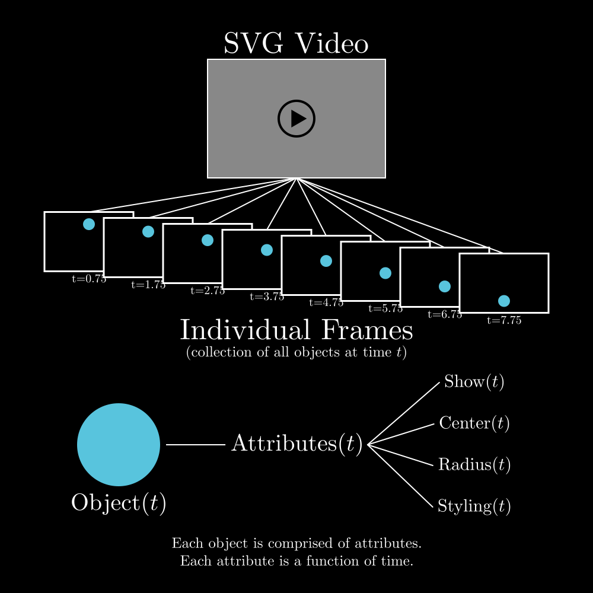

<p align="center">
    
</p>

<p align="center">
    <b>An entirely vector-based math-oriented animation engine.</b>
</p>

VectorMation produces compact SVG animations by treating every visual property as a function of time. Instead of rasterising frames, it generates precise vector graphics that can be played back in a browser, exported as SVGs, GIFs, or video.

It provides an alternative to [manim](https://github.com/3b1b/manim), with a pixel coordinate system, explicit timing model, and native SVG export.

## Installation

```bash
pip install vectormation
```

### System Requirements

**Python dependencies** (installed automatically):

- `numpy`, `svgpathtools`, `beautifulsoup4`, `lxml`, `websockets`

**Optional dependencies:**

| Package | Used for |
|---|---|
| `cairosvg` + `Pillow` | PNG / GIF / video export |
| `ffmpeg` (system) | Video export |
| LaTeX distribution | `TexObject` / `SplitTexObject` |
| `mkdocs` + `mkdocs-material` | Building documentation |

## Quick Start

```python
from vectormation.objects import *

canvas = VectorMathAnim(save_dir='svgs/spiral', width=1000, height=1000)
canvas.set_background()

point = Dot()
trace = Trace(point.c, stroke_width=5)
point.c.set(start=0, end=5, func_inner=lambda t: (t * 80 + 500, 500))
point.c.rotate_around(0, 5, pivot_point=(500, 500), degrees=360 * 4)

canvas.add_objects(trace, point)
canvas.browser_display(fps=60)
```

This opens a browser window showing a spiral being drawn in real time.

## Features

- **Time-varying attributes** -- every property (position, colour, opacity, ...) is a function of time
- **Browser-based viewer** -- real-time playback with zoom, speed control, sections, and keyboard shortcuts
- **Morphing** -- smoothly morph any shape into any other, with optional rotation
- **LaTeX support** -- render LaTeX expressions as animatable SVG objects
- **Graph plotting** -- plot mathematical functions with axes, ticks, and labels
- **Path animation** -- draw objects along paths, animate stroke-dashoffset
- **Export** -- SVG frames, animated GIFs, PNG, and MP4 video

## CLI Arguments

Scripts can use `parse_args()` to accept common command-line flags:

```python
from vectormation.objects import VectorMathAnim, parse_args

args = parse_args()
canvas = VectorMathAnim(save_dir='svgs/my_anim', verbose=args.verbose)
# ... build your animation ...
canvas.browser_display(fps=args.fps, port=args.port)
```

| Flag | Default | Description |
|---|---|---|
| `-v`, `--verbose` | off | Enable debug logging |
| `--port PORT` | 8765 | Browser viewer WebSocket port |
| `--fps FPS` | 60 | Frames per second |

## Browser Controls

| Key | Action |
|---|---|
| **Space** / **P** | Pause / Resume |
| **R** | Restart |
| **Arrow Right** | Next section |
| **Arrow Left** | Step one frame backward |
| **S** | Save current frame as SVG |
| **F** | Reset zoom |
| **Q** | Quit |
| **+** / **-** | Speed up / slow down |
| **1**--**9** | Jump to 10%--90% |
| **N** | Toggle snap-to-point mode |
| **D** | Debug panel |
| **Scroll** | Zoom at cursor |

## Documentation

Full documentation is available at [jorisperrenet.github.io/VectorMation](https://jorisperrenet.github.io/VectorMation/).

To build and serve locally:

```bash
cd docs && mkdocs serve
```

## Examples

See the [`examples/`](https://github.com/jorisperrenet/VectorMation/tree/main/examples) directory:

- `spiral.py` -- spiralling dot with trace
- `morphing_example.py` -- LaTeX text morphing
- `rotating_morph.py` -- circle-to-square morph with 360 spin
- `graph_example.py` -- static function plot
- `graph_animated.py` -- animated sin + cos curves
- `speed_and_sections.py` -- section breaks and speed controls
- `heart.py`, `sierpinski_triangle.py`, `logo.py`, and more

## Architecture

The code to generate the below SVG can be found in `examples/code_explanation.py`.

<p align="center">
    
</p>

All attributes are functions of time. Evaluating these functions at a certain time gives precise information about every object; combining all objects produces the frame at that time. Repeatedly doing this for different times gives a video, displayed via the browser-based SVG viewer.
