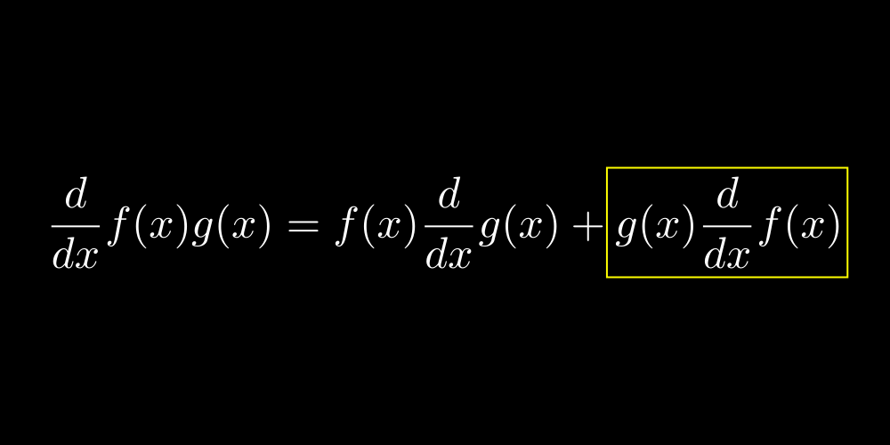
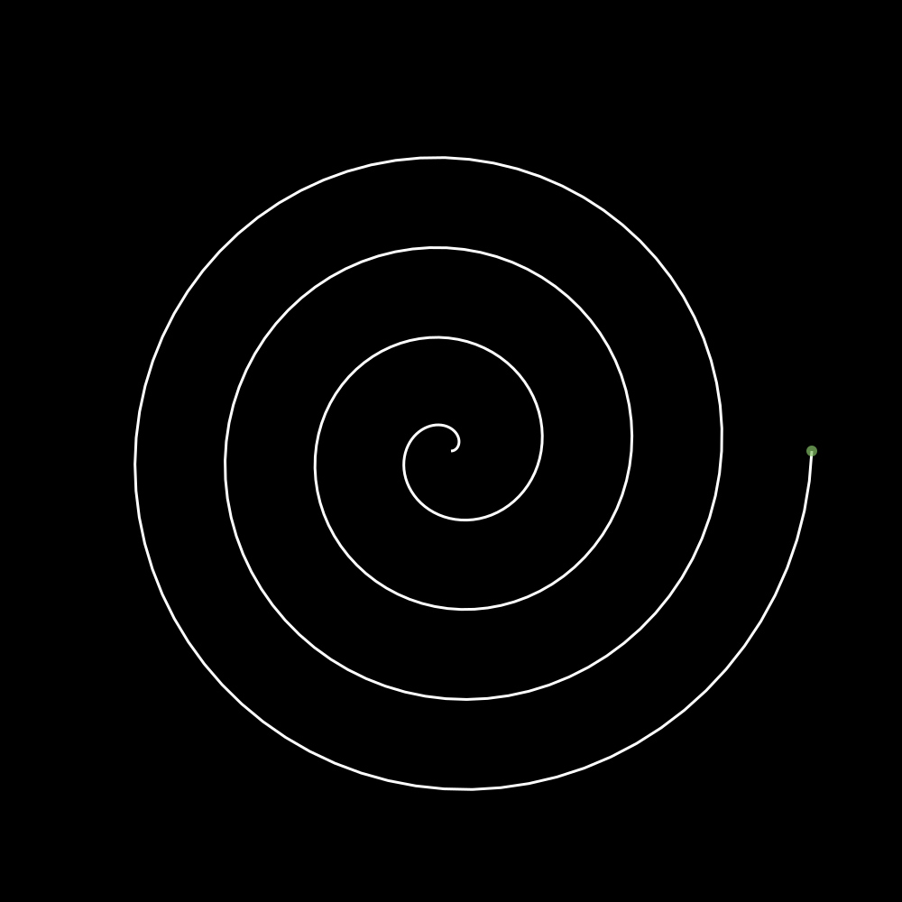

# Examples

This directory contains 300+ VectorMation examples organized into four categories:

## Directory Structure

| Directory | Description |
|---|---|
| **`showcase/`** | Full demonstrations: spirals, hearts, morphing, graphs, physics, 3D, UI widgets, and more |
| **`reference/`** | Concise single-feature examples used in the documentation (shapes, animations, axes, charts, 3D, etc.) |
| **`advanced/`** | Complex examples: Fourier circles, double pendulum, Mandelbrot zoom, Galton board, convolutions, boolean ops, etc. |
| **`manim/`** | Recreations of [Manim Community](https://docs.manim.community/en/stable/examples.html) examples in VectorMation |

## Running an Example

From the repository root:

```bash
PYTHONPATH=. python examples/showcase/spiral.py          # opens browser viewer
PYTHONPATH=. python examples/showcase/spiral.py -o out.mp4  # export to video
PYTHONPATH=. python examples/showcase/spiral.py -o frame.svg # export single SVG frame
```

If you installed VectorMation (`pip install -e .` or `pip install vectormation`), you can omit `PYTHONPATH=.`.

## Some Results

If the example includes animation, the images below show the last frame.

`showcase/heart.py`
<p align="center">
    
</p>

`manim/moving_frame_box.py`
<p align="center">
    
</p>

`showcase/spiral.py`
<p align="center">
    
</p>
